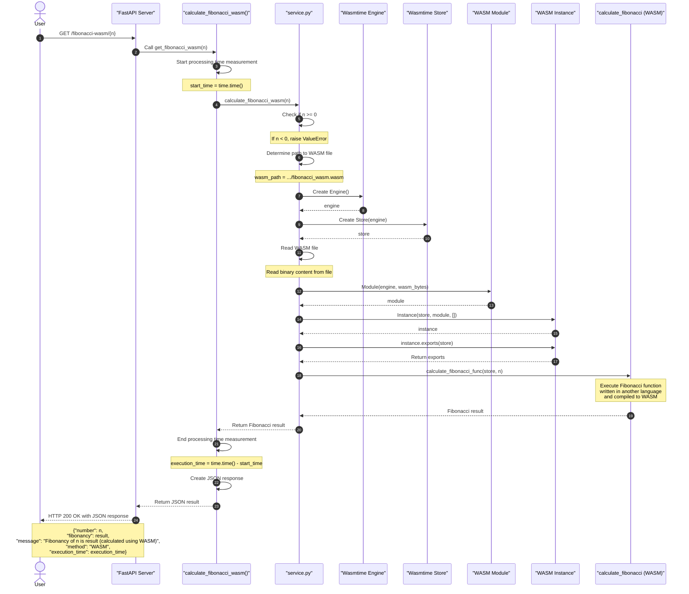

# WebAssembly (WASM) Integration with Python/FastAPI

A demo showcasing WebAssembly integration with Python/FastAPI for computation optimization, using Fibonacci calculation as a performance comparison example.

## Project Structure

```
wasm-demo/
├── app/
│   ├── main.py             # FastAPI server
│   ├── service.py          # Python service
│   ├── Cargo.toml          # Rust project config
│   ├── wasm/
│   │   ├── src/
│   │   │   └── lib.rs          # Rust source for Fibonacci
│   │   └── build/
│   │       └── fibonacci_wasm.wasm  # Compiled WASM module
│   │   └── Cargo.toml          # Rust project config
│   └── requirements.txt    # Python dependencies

```

## Prerequisites

### 1. Install Rust and WASM target

```bash
curl --proto '=https' --tlsv1.2 -sSf https://sh.rustup.rs | sh
rustup target add wasm32-unknown-unknown
```

### 2. Install Python dependencies

```bash
pip install -r app/requirements.txt
```

## Creating a WASM Module from Rust

### 1. Rust Code (src/lib.rs)

```rust
#[no_mangle]
pub extern "C" fn calculate_fibonacci(n: u32) -> u64 {
    if n == 0 {
        return 0;
    }
    if n == 1 || n == 2 {
        return 1;
    }
    
    // Using iterative approach instead of recursive for better performance
    let mut prev = 0u64;
    let mut curr = 1u64;
    
    for _ in 2..=n {
        let next = prev + curr;
        prev = curr;
        curr = next;
    }
    
    curr
}
```

### 2. Cargo.toml Configuration

```toml
[package]
name = "fibonacci-wasm"
version = "0.1.0"
edition = "2021"

[lib]
crate-type = ["cdylib"]

[profile.release]
lto = true
opt-level = 3
```

### 3. Build WASM Module

```bash
cd app/wasm
cargo build --release --target wasm32-unknown-unknown
mkdir -p build
cp target/wasm32-unknown-unknown/release/fibonacci_wasm.wasm build/
```

## Python Integration with WASM

### 1. WASM Service (wasm_service.py)

```python
import os
from wasmtime import Engine, Store, Module, Instance

def calculate_fibonacci_wasm(n: int) -> int:
    """Calculate Fibonacci number using WASM module."""
    if n < 0:
        raise ValueError("Fibonacci is not defined for negative numbers")

    wasm_path = os.path.join(os.path.dirname(__file__), 'simple_wasm', 'fibonacci_wasm.wasm')
    
    engine = Engine()
    store = Store(engine)
    
    with open(wasm_path, 'rb') as f:
        wasm_bytes = f.read()
    
    module = Module(engine, wasm_bytes)
    instance = Instance(store, module, [])
    calculate_fibonacci_func = instance.exports(store)["calculate_fibonacci"]
    
    return calculate_fibonacci_func(store, n)
```

### 2. API Endpoints (main.py)

```python
from fastapi import FastAPI, HTTPException
from service import calculate_fibonacci
from wasm_service import calculate_fibonacci_wasm

app = FastAPI()

@app.get("/fibonacci-wasm/{n}")
async def get_fibonacci_wasm(n: int):
    try:
        result = calculate_fibonacci_wasm(n)
        return {
            "number": n,
            "fibonacci": result,
            "method": "WASM"
        }
    except Exception as e:
        raise HTTPException(status_code=400, detail=str(e))
```

## Running and Testing

```bash
# Run the server
uvicorn main:app --reload --port 8000

# Test WASM implementation
curl http://localhost:8000/fibonacci-wasm/39

# Performance comparison (try with n=40)
hey -z 40s -c 20 -t 30 http://localhost:8000/fibonacci-wasm/39
```

## Diagram


WebAssembly typically provides better performance for complex calculations as it compiles to near-native machine code. 