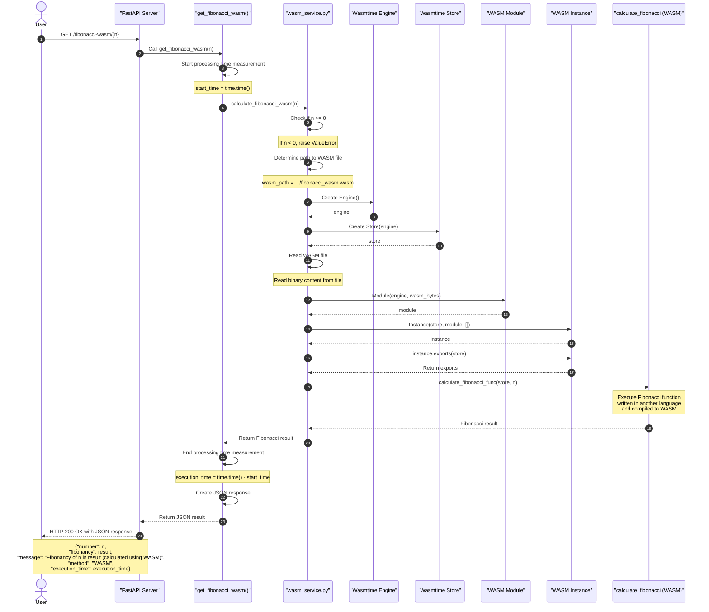

```mermaid
sequenceDiagram
    autonumber
    actor User
    participant FastAPI as "FastAPI Server"
    participant Handler as "get_fibonacci_wasm()"
    participant WasmService as "wasm_service.py"
    participant Engine as "Wasmtime Engine"
    participant Store as "Wasmtime Store"
    participant Module as "WASM Module"
    participant Instance as "WASM Instance"
    participant WasmFunc as "calculate_fibonacci (WASM)"
    
    User->>FastAPI: GET /fibonacci-wasm/{n}
    FastAPI->>Handler: Call get_fibonacci_wasm(n)
    
    Handler->>Handler: Start processing time measurement
    Note over Handler: start_time = time.time()
    
    Handler->>WasmService: calculate_fibonacci_wasm(n)
    
    WasmService->>WasmService: Check if n >= 0
    Note over WasmService: If n < 0, raise ValueError
    
    WasmService->>WasmService: Determine path to WASM file
    Note over WasmService: wasm_path = .../fibonacci_wasm.wasm
    
    WasmService->>Engine: Create Engine()
    Engine-->>WasmService: engine
    
    WasmService->>Store: Create Store(engine)
    Store-->>WasmService: store
    
    WasmService->>WasmService: Read WASM file
    Note over WasmService: Read binary content from file
    
    WasmService->>Module: Module(engine, wasm_bytes)
    Module-->>WasmService: module
    
    WasmService->>Instance: Instance(store, module, [])
    Instance-->>WasmService: instance
    
    WasmService->>Instance: instance.exports(store)
    Instance-->>WasmService: Return exports
    
    WasmService->>WasmFunc: calculate_fibonacci_func(store, n)
    Note over WasmFunc: Execute Fibonacci function<br/>written in another language<br/>and compiled to WASM
    WasmFunc-->>WasmService: Fibonacci result
    
    WasmService-->>Handler: Return Fibonacci result
    
    Handler->>Handler: End processing time measurement
    Note over Handler: execution_time = time.time() - start_time
    
    Handler->>Handler: Create JSON response
    
    Handler-->>FastAPI: Return JSON result
    FastAPI-->>User: HTTP 200 OK with JSON response
    Note over User,FastAPI: {"number": n,<br/>"fibonancy": result,<br/>"message": "Fibonancy of n is result (calculated using WASM)",<br/>"method": "WASM",<br/>"execution_time": execution_time}
```